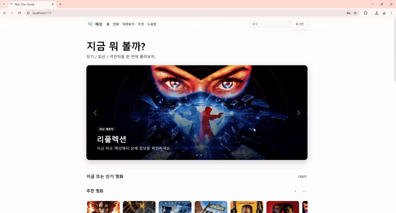
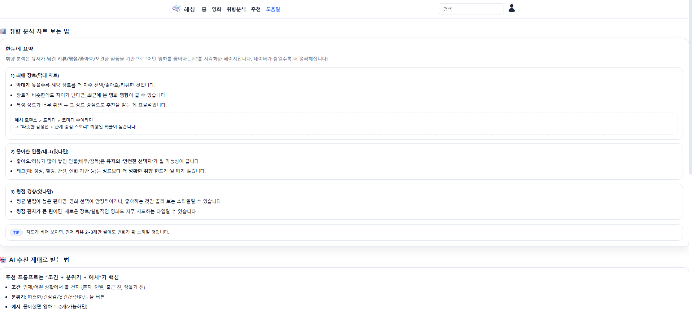
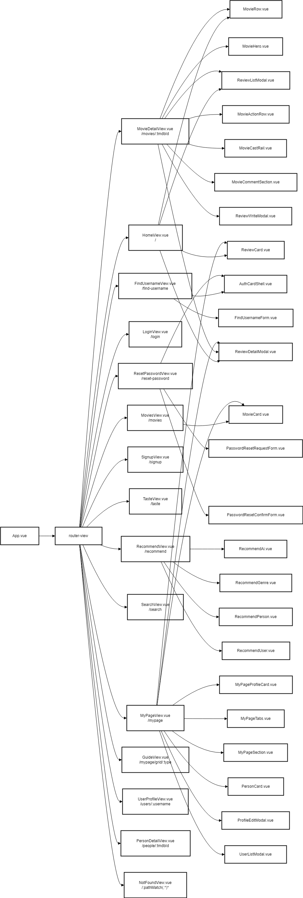

# ☄️ 혜성 (Comet)
사용자 취향 기반 AI 영화 추천 및 커뮤니티 서비스

- 개발 기간: 2025.12.19 ~ 2025.12.25
- SSAFY 14기 관통 프로젝트 (1학기 최종 프로젝트)

---

## 1. 프로젝트 소개
혜성(Comet)은 사용자의 취향 데이터를 기반으로 영화를 추천하고, 영화에 대한 **코멘트/좋아요/보고싶어요** 기능을 통해 커뮤니티 활동까지 연결하는 서비스입니다.

---

## 2. 팀원 소개
| 이름 | 역할 | 담당 |
|---|---|---|
| 김혜령(팀장) | Back-end | DB 설계 및 백엔드 전반 구축, 프론트 구현 및 리팩토링, 일정/이슈 관리 |
| 이규성(팀원) | Front-end | UI/UX 시안 디자인, 프론트 구조 설계 및 구현, 백엔드 기능 보조 |

---

## 3. 기술 스택 (Tech Stack)
- Frontend: Vue.js 3, Pinia, Bootstrap 5  
- Backend: Python, Django REST Framework (DRF)  
- Data & AI: TMDB API, GMS_KEY, VITE_YOUTUBE_API_KEY  
- Tools: Git, Figma, Notion  

---

## 4. 실행 방법 (Getting Started)

> ✅ 실행 전 준비물  
> - Python 3.10+ (권장)  
> - Node.js 18+ (권장)  
> - TMDB API Key  
> - (선택) YouTube API Key  
> - (선택) GMS_KEY (AI 추천 호출 시)

### 4.1 레포 클론
```bash
git clone <YOUR_REPO_URL>
cd <YOUR_REPO_FOLDER>
````

---

### 4.2 Backend (Django REST Framework)

```bash
cd backend

# 가상환경 생성/활성화
python -m venv venv

# Windows
venv\Scripts\activate
# macOS/Linux
source venv/bin/activate

# 패키지 설치
pip install -r requirements.txt

# 마이그레이션
python manage.py migrate
```

#### ✅ Backend 환경변수 설정 (.env)

`backend/.env` 파일을 만들고 아래 형식으로 작성하세요.

```env
DJANGO_SECRET_KEY=YOUR_SECRET_KEY
DEBUG=1
ALLOWED_HOSTS=127.0.0.1,localhost

TMDB_API_KEY=YOUR_TMDB_KEY
GMS_KEY=YOUR_GMS_KEY
YOUTUBE_API_KEY=YOUR_YOUTUBE_KEY
```

#### 서버 실행

```bash
python manage.py runserver
```

---

### 4.3 Frontend (Vue 3 + Vite)

```bash
cd ../frontend
npm install
npm run dev
```

#### ✅ Frontend 환경변수 설정 (.env)

`frontend/.env` 파일을 만들고 아래 형식으로 작성하세요.

```env
VITE_API_BASE_URL=http://127.0.0.1:8000/api
VITE_YOUTUBE_API_KEY=YOUR_YOUTUBE_KEY
```

---

### 4.4 TMDB 데이터 동기화 (초기 세팅 필수)

> ✅ 프로젝트는 TMDB 데이터를 DB에 **사전 적재(동기화)** 후 사용합니다.
> 데이터가 없으면 일부 기능(검색/추천/상세/인물)이 정상 동작하지 않을 수 있습니다.

```bash
cd ../backend
source venv/bin/activate  # (Windows는 venv\Scripts\activate)

# (1) 전체 데이터 벌크 동기화
python manage.py sync_tmdb_bulk --pages 25 --with-credits --sleep 0.35

# (2) 홈 화면 구성용 데이터 동기화(빠른 갱신)
python manage.py sync_tmdb_home --pages 5 --no-credits
```

---

### 4.5 접속 URL

* Frontend: [http://localhost:5173](http://localhost:5173)
* Backend(API): [http://127.0.0.1:8000/api](http://127.0.0.1:8000/api)

---

## 5. 핵심 기능 (GIF)

### (1) 페이지 공통 기능


- 반응형 웹 디자인: 860px 이하 모바일 환경 대응(햄버거 메뉴)
- 7가지 컬러 테마: 사용자 테마 변경
- 마이크로 인터랙션: 버튼/카드 호버 시 확대, 커서 변경
- 랜덤 배너 & 큐레이션: 접속 시마다 새로운 추천 + 평점/최신/관객수 기준 제공
- Footer: 개인정보처리방침/이용약관, 맨 위로 이동 버튼
- 새 페이지 진입 시 스크롤 최상단 이동

---

### (2) 메인페이지


- 메인 배너: 랜덤 영화 추천(클릭 시 상세 페이지 이동) + 서비스 가이드 이동
- 관객수/평점 기반 추천 영화(더보기 → 추천 검색 이동)
- 최신 개봉작(더보기 → 최신 검색 이동)
- 평론가 별점 순 작품(더보기 → 별점순 검색 이동)
- 최근 유저 코멘트(더보기 → 전체 코멘트)
- 코멘트 클릭 시 코멘트 디테일 창  
  - user_id 검사 후 코멘트 수정/삭제 버튼  
  - 댓글 작성/삭제

---

### (3) 회원가입 / 로그인


- 회원가입: 이메일 양식, 아이디 중복, 비밀번호 8자 이상 등 유효성 검사
- 로그인: 아이디/이메일 모두 로그인 가능

---

### (4) 영화 상세 페이지


- 좋아요 / 코멘트 / 보고싶어요 / 트레일러 시청(YouTube) 제공
- 좋아요: 마이페이지에서 확인 가능
- 코멘트: 작성/수정/삭제 가능 + 마이페이지에서 작성 영화 확인
- 보고싶어요: 보관함에서 확인 가능  
  - 코멘트 작성 시 자동으로 보고싶어요 목록에서 제거 + 코멘트 작성 영화로 이동
- 디테일 화면: Navbar 투명 처리, 상단 가로 포스터 + 제목/장르/연도 배치
- 출연/제작 인물 클릭 시 인물 상세 페이지 이동
- 코멘트 더보기: 좋아요/최신순 정렬
- 관련 장르 추천 영화(인기순) 배치

---

### (5) 취향분석 페이지


- 시청한 영화: 코멘트 작성 영화 기반으로 목록 제공(전체 보기 가능)
- 최애 장르: 장르별 모아보기(필터/검색)
- 평균 별점: 사용자 별점 평균 제시 + 별점별 모아보기
- 레이더 차트(Radar Chart): 장르 분포를 시각적으로 제공
- 최근 시청 영화 기반: 관련 장르 순위별 추천 제시

---

### (6) 추천 탭


- AI 맞춤 추천(채팅): 다중 대화 지원  
  - `SYSTEM_PROMPT_REASONS`, `SYSTEM_PROMPT_FILTER`로 규칙/출력 형식 제한
- 장르 추천: 장르별 평균 별점(5점 만점) 제시 + 필터링
- 인물 추천:
  - 랜덤 인물 제시 / 다른 인물 보기 / 인물 검색 / 인기 인물 선택
  - 하트(좋아요) → 마이페이지에서 확인
  - 인물 상세: 출연/감독 구분 작품 제시 + 작품 추천
- 유저 추천: 리뷰 활동 많은 유저 추천
- 실시간 TOP 활동: 리뷰 작성 유도 + 새로고침 버튼

---

### (7) 도움말 탭


- 서비스 이용 가이드 및 전반적인 소개

---

### (8) 마이페이지


#### 프로필 수정
- 사진 변경 / 이름 변경 / 비밀번호 변경 / 회원탈퇴

#### 팔로잉/팔로워
- 목록 모달 제공 → 유저 클릭 시 유저 상세 페이지 이동

#### 보관함
- 코멘트 작성 영화 / 좋아요 영화 / 보고싶은 영화
- 더보기 + 드롭다운 정렬(담은순/역순/내 별점 높은순/낮은순/신작/구작)

#### 좋아요
- 좋아요 인물(카드 표시 + 해제 가능)
- 좋아요한 코멘트(드롭다운 + 코멘트 상세 이동)
- 더보기로 전체 확인

---

## 6. 기술 구현 상세

### 6.1 인증/권한 처리
- 토큰 저장 및 로그인 상태 유지 (Pinia Store)
- API 요청 시 인증 헤더 자동 적용 (Axios Interceptor)

> 관련 파일: `src/stores/auth.js`, `src/api/axios.js`

<details>
  <summary>핵심 코드 보기 (Pinia: 로그인 상태 복구 & 토큰 저장)</summary>

```js
// src/stores/auth.js (핵심 부분 발췌)

// ✅ 앱 최초 진입 / 새로고침 시 로그인 상태 복구
async bootstrap() {
  const access = localStorage.getItem('access') // 로컬 토큰 확인
  if (!access) {
    this.user = null // 토큰 없으면 비로그인 처리
    return
  }

  try {
    const me = await fetchMe() // ✅ 토큰으로 내 정보 조회
    this.user = me // ✅ 로그인 상태 복구
  } catch (e) {
    // ✅ 토큰이 만료/오류이면 깨끗하게 정리
    localStorage.removeItem('access')
    localStorage.removeItem('refresh')
    this.user = null
  }
},
````

</details>

<details>
  <summary>핵심 코드 보기 (Axios: 인증 헤더 주입 + 401 Refresh 재발급 + 요청 큐)</summary>

```js
// src/api/axios.js (핵심 부분 발췌)

import axios from 'axios'

const RAW_BASE = import.meta.env.VITE_API_BASE_URL || 'http://127.0.0.1:8000/api'
const BASE = RAW_BASE.replace(/\/$/, '')

const api = axios.create({
  baseURL: BASE,
  withCredentials: false,
})

// ✅ 1) 모든 요청에 access 토큰 자동 첨부
api.interceptors.request.use((config) => {
  const token = localStorage.getItem('access')
  if (token) config.headers.Authorization = `Bearer ${token}`
  return config
})

let isRefreshing = false
let queue = []

// ✅ 2) 401 → refresh → 원 요청 재시도 + 대기 요청 큐 처리
api.interceptors.response.use(
  (res) => res,
  async (error) => {
    const original = error.config
    if (!original) return Promise.reject(error)

    if (error.response?.status === 401 && !original._retry) {
      original._retry = true
      const refresh = localStorage.getItem('refresh')
      if (!refresh) return Promise.reject(error)

      if (isRefreshing) {
        return new Promise((resolve, reject) => {
          queue.push({
            resolve: (token) => {
              original.headers.Authorization = `Bearer ${token}`
              resolve(api(original))
            },
            reject,
          })
        })
      }

      isRefreshing = true
      try {
        const r = await axios.post(`${BASE}/auth/refresh/`, { refresh })
        const newAccess = r.data.access
        localStorage.setItem('access', newAccess)

        queue.forEach(({ resolve }) => resolve(newAccess))
        queue = []

        original.headers.Authorization = `Bearer ${newAccess}`
        return api(original)
      } catch (e) {
        localStorage.removeItem('access')
        localStorage.removeItem('refresh')
        queue.forEach(({ reject }) => reject(e))
        queue = []
        return Promise.reject(e)
      } finally {
        isRefreshing = false
      }
    }

    return Promise.reject(error)
  }
)

export default api
```

</details>

---

### 6.2 영화 데이터 수집/가공 (TMDB 동기화 Management Command)

* 서비스에서 사용하는 영화/인물/크레딧 데이터를 **TMDB → DB로 사전 동기화**하여, 화면 로딩 시 외부 API 의존도를 낮추고 일관된 추천/검색 경험을 제공합니다.
* 초기/갱신 시 동기화가 선행되어야 하며, 동기화가 되지 않으면 일부 기능에서 데이터 누락(동기화 오류)이 발생할 수 있습니다.

> 실행 위치: `backend/` (Django)

#### 실행 방법 (초기 세팅/데이터 갱신)

```bash
# (1) TMDB 전체 데이터 벌크 동기화 (페이지 단위)
python manage.py sync_tmdb_bulk --pages 25 --with-credits --sleep 0.35

# (2) 홈 화면 구성용 데이터 동기화 (빠르게 갱신)
python manage.py sync_tmdb_home --pages 5 --no-credits
```

---

### 6.3 코멘트/좋아요/보고싶어요 도메인 로직

* 동일 컴포넌트에서 상태 변화(추가/삭제/수정) 즉시 반영
* 마이페이지 보관함과 상세 페이지 연동

> 관련 파일: `src/stores/review.js`, `src/components/review/*`

<details>
  <summary>핵심 코드 보기 (MovieDetail: 보고싶어요/리뷰작성/리뷰좋아요/댓글 즉시 반영)</summary>

```js
// src/views/MovieDetailView.vue (핵심 발췌)

// ✅ 보고싶어요 토글: 상태 변경 → loadAll()로 상세 화면 데이터 재동기화
async function onToggleWish() {
  if (!authStore.isLoggedIn) return alert('로그인 필요')
  try {
    const res = await toggleMovieWish(Number(tmdbId.value))
    isWished.value = res.wished

    if (!res.wished) {
      myReview.value = null // ✅ 보고싶어요 삭제 시 내 리뷰 상태도 정리
    }

    loadAll() // ✅ 상세 데이터(좋아요/보고싶어요/리뷰/댓글 등) 재조회로 즉시 반영
  } catch (err) {
    alert(err.response?.data?.detail || '오류가 발생했습니다.')
  }
}

// ✅ 리뷰 작성/수정: 성공 시 모달 닫고 loadAll()로 리스트/상태 즉시 반영
async function handleWriteSubmit(payload) {
  try {
    const body = { content: payload.content, rating: payload.rating, watched: true }

    // ✅ 내 리뷰가 있으면 수정, 없으면 생성
    if (myReview.value?.id) await updateReview(myReview.value.id, body)
    else await createMovieReview(Number(tmdbId.value), body)

    showWriteModal.value = false
    await loadAll() // ✅ 작성 직후 코멘트 목록/내 리뷰/보고싶어요 상태까지 동기화
  } catch {
    alert('오류가 발생했습니다.')
  }
}

// ✅ 리뷰 좋아요: "선택 리뷰 + 리스트" 둘 다 업데이트해서 모달/리스트 싱크 유지
async function handleReviewLike(reviewId) {
  try {
    const res = await toggleReviewLike(reviewId)

    // 1) 모달에서 보고 있는 선택 리뷰 업데이트
    if (selectedReview.value?.id === reviewId) {
      selectedReview.value.is_liked = res.liked
      selectedReview.value.like_count = res.like_count
    }

    // 2) 화면의 리뷰 리스트도 동시에 업데이트
    reviews.value = reviews.value.map((r) =>
      r.id === reviewId ? { ...r, is_liked: res.liked, like_count: res.like_count } : r
    )
  } catch (e) {
    console.error('리뷰 좋아요 실패:', e)
  }
}

// ✅ 댓글 작성: 서버 반영 후 selectedReview의 댓글 수/목록을 즉시 업데이트
async function handleReplySubmit(content) {
  try {
    const newC = await createReviewComment(selectedReview.value.id, { content })
    reviewComments.value.unshift(newC) // ✅ UI 즉시 반영
    selectedReview.value.comment_count++
  } catch {
    alert('댓글 등록 실패')
  }
}
```

</details>

<details>
  <summary>핵심 코드 보기 (ReviewDetailModal: 이벤트 emit으로 “상위에서 상태 일괄 관리”)</summary>

```js
// src/components/review/ReviewDetailModal.vue (핵심 발췌)

const emit = defineEmits(['close', 'edit', 'delete', 'like', 'reply-submit', 'reply-delete'])

// ✅ 좋아요 클릭 → 상위(MovieDetail)로 이벤트만 전달 (상위가 상태/리스트를 함께 갱신)
function toggleLike() {
  emit('like', localReview.value.id)
}

// ✅ 댓글 등록 → 상위가 API 호출/상태 업데이트 담당
async function submitReply() {
  const content = replyContent.value.trim()
  if (!content) return
  emit('reply-submit', content)
  replyContent.value = ''
}

// ✅ 댓글 삭제도 상위에 위임 (상위에서 comment_count까지 같이 정리)
function deleteReply(id) {
  emit('reply-delete', id)
}
```

</details>

---

### 6.4 AI 추천(프롬프트 제어)

* SYSTEM_PROMPT로 출력 포맷 제한 및 추천 근거 제공
* 사용자 입력을 필터링/정규화하여 일관된 결과 유도

> 관련 파일: `src/components/recommend/*`

<details>
  <summary>핵심 코드 보기 (RecommendAi: 대화 히스토리 유지 + 추천근거 렌더링)</summary>

```js
// src/components/recommend/RecommendAi.vue (핵심 발췌)

async function sendChat() {
  if (!input.value.trim()) return

  // ✅ 사용자 입력 즉시 UI에 표시
  messages.value.push({ role: 'user', content: input.value })

  // ✅ 직전 N개 히스토리를 서버로 전달해 문맥 유지
  const history = messages.value.slice(-10).map((m) => ({
    role: m.role,
    content: m.content,
  }))

  const payload = {
    user_input: input.value,
    history,
  }

  input.value = ''
  loading.value = true

  try {
    const res = await postTasteChat(payload)

    // ✅ 서버 응답(추천 텍스트) 표시
    messages.value.push({
      role: 'assistant',
      content: res?.answer || '추천 결과를 불러오지 못했습니다.',
    })

    // ✅ 추천 근거(why)도 함께 내려오면 UI에 표시 가능하게 저장
    if (Array.isArray(res?.recommended_reasons)) {
      lastReasons.value = res.recommended_reasons
    }

    // ✅ 유저별 채팅 저장(새로고침해도 유지)
    saveMessages()
  } finally {
    loading.value = false
  }
}

function saveMessages() {
  const key = `comet_chat_${authStore.user?.username || 'guest'}`
  localStorage.setItem(key, JSON.stringify(messages.value))
}
```

</details>

---

## 7. ERD (Entity Relationship Diagram)

핵심 도메인(User–Follow / Movie–Genre / Review–Comment / Like)을 중심으로 ERD를 구성했습니다.

* Review는 (user_id, movie_id) 기준으로 **1인 1리뷰**를 보장합니다.
* Like/Follow는 중복 방지를 위해 **유니크 제약(Unique Constraint)**을 적용했습니다.

### 핵심 ERD


<details>
  <summary>전체 ERD 보기</summary>
  <br/>
  
</details>

---

## 8. Component Structure

Vue.js 컴포넌트 구조도
“View는 흐름(라우팅/상태), Component는 UI 재사용” 원칙으로 구조화
카드/행(Row) 컴포넌트는 여러 화면에서 동일 UI를 공유
모달/폼 컴포넌트는 기능 단위로 분리해 유지보수/확장성 강화

<details>
  <summary>컴포넌트 구조 보기</summary>
  <br/>
  
  <br/>
  👉 원본 PDF: <a href="./README_img/components_diagram2.pdf">components_diagram2.pdf</a>
</details>

---

## 9. 회고

김혜령
**혜성(Comet)**을 진행하면서 “기능이 따로 존재하는 게 아니라, 서로 연결되어 하나의 서비스 경험이 된다”는 걸 끝까지 구현하며 체감했다. 단순히 화면을 만들고 API를 붙이는 수준이 아니라, 로그인 상태 유지 → 영화 상세에서 액션(좋아요/코멘트/보고싶어요) → 마이페이지/취향분석/추천으로 자연스럽게 이어지는 흐름을 맞추는 과정이 가장 큰 학습이었다.

특히 기억에 남는 건 **인증/권한 처리와 상태 동기화**였다. Pinia로 로그인 상태를 복구하고, Axios interceptor로 토큰 주입/401 refresh/요청 큐 처리를 구성하면서 “사용자는 끊김 없이 쓰는데 내부에서는 안정적으로 갱신되는 구조”가 왜 중요한지 배웠다. 또한 코멘트/좋아요/보고싶어요처럼 상태 변화가 잦은 도메인은, 컴포넌트를 잘게 나누는 것만큼 **상위에서 상태를 일괄 관리하고 즉시 반영하는 설계**가 유지보수에 결정적이라는 걸 느꼈다.

백엔드에서는 TMDB 데이터를 사전 동기화(Management Command)해서 외부 API 의존도를 낮추고, 서비스 경험을 일관되게 유지하는 방식을 선택했다. 이 과정에서 “데이터를 가져오는 것”보다 “서비스에서 쓰기 좋게 쌓고, 누락/갱신을 관리하는 것”이 더 어렵다는 걸 체감했고, 데이터 동기화가 안 되면 기능 전체가 흔들릴 수 있다는 점도 배웠다.

아쉬운 점은 일정이 촉박한 상황에서 기능 범위가 커지며, 일부 기능은 더 깔끔한 구조로 리팩토링할 여지가 남았다는 것이다. 다음에는 기능 구현 속도만큼 **테스트/에러 케이스 정리, 문서화(API 명세/상태 흐름), 우선순위 공유**를 더 자주 하면서 팀의 리듬을 안정적으로 가져가고 싶다.

결과적으로 이번 프로젝트는 Vue + DRF로 **실제 서비스 수준의 흐름(회원/리뷰/추천/마이페이지)을 처음부터 끝까지 완성**해본 경험이었다. 다음 단계에서는 추천 품질(프롬프트/필터/평가)과 데이터 설계(확장 가능한 취향 지표), 그리고 성능(캐싱/쿼리 최적화)까지 신경 쓰는 방향으로 발전시키고 싶다.

---

이규성
실제 서비스 흐름(회원/리뷰/추천/마이페이지)을 끝까지 구현해보며, “기능이 연결되는 경험”을 제대로 해볼 수 있어 의미 있었다.
프론트 UI/UX 시안을 기반으로 화면 구조를 설계하고 구현하면서 컴포넌트 분리, 재사용 구조에 대한 감각이 생겼다.

이번 프로젝트를 하면서 프론트(화면/UX)를 먼저 그려두고 → 그 흐름에 맞춰 백엔드를 설계하는 방식이 오히려 전체 구현이 더 수월하다고 느꼈다.
LLM을 정말 많이 활용하며 개발했는데, “도구를 쓰는 것”과 “제대로 검증하며 쓰는 것”은 다르다는 걸 체감했다. 프롬프트 작성/검증/리팩토링 관점에서 더 공부가 필요하다고 느꼈다.

다만 아쉬웠던 점은 협업 과정에서 작업 방향과 우선순위를 조금 더 자주 공유했으면 하는 점이다.
